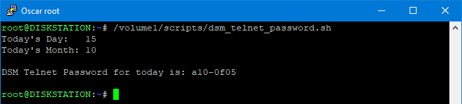

# Synology DSM Recovery Telnet Password

### Description

Synology DSM Recovery Telnet Password of the Day generator

If a DSM update fails the boot loader will enable telnet to make it possible to recover from the failed DSM update. The DSM recovery telnet password was originally blank. Later Synology changed it to 101-0101

If a blank password or 101-0101 does not work you need to either contact Synology Support for the 'password of the day', or you can run this script which will show you the 'password of the day'.

### Screen shots

 

Script on Windows with WSL

 

Script on Synology NAS

